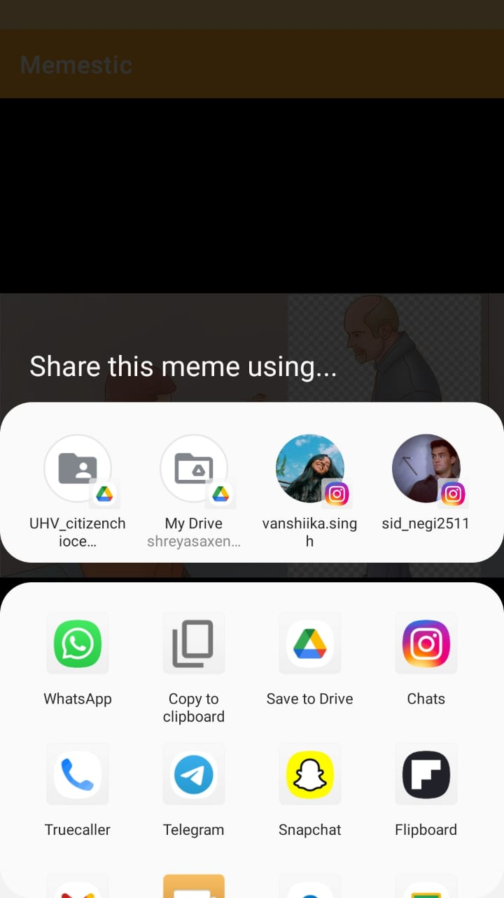

# Memestic

Meme Sharing app with the functionality of sharing Meme that is being fetched by reddit using API. Learned Volley, Glide Library, Volley Singleton Class and Glide Response Library.

**Memestic Main Page**

**App Icon**

**Memestic When Share Button is Clicked**

It provide the share functionality of the URL of the Meme. 

**Memestic When Next Button is Clicked**

It will fetch next meme from reddit using api and if size of meme is too large it will show buffering

